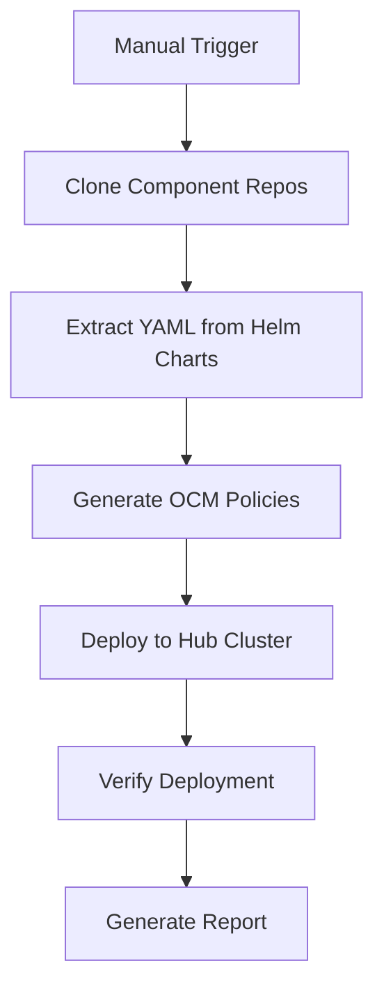

# SxM Component Deployment Pipeline

This repository contains a comprehensive CI/CD pipeline for deploying SxM (Seamless cross-layer Monitoring) components across multi-cluster environments using OCM (Open Cluster Management) policies.

## 🏗️ Pipeline Architecture



## 🚀 Quick Start

### Prerequisites

1. **GitHub Repository**: This pipeline runs on GitHub Actions
2. **Kubernetes Clusters**: 
   - 1 Hub cluster with OCM installed
   - 1+ Managed clusters registered with OCM
3. **kubectl Access**: Configured kubeconfig with access to all clusters
4. **OCM Setup**: Open Cluster Management must be installed and configured

### Running the Pipeline

1. **Navigate to Actions Tab** in your GitHub repository
2. **Select "Deploy SxM Components via OCM Policies"** workflow
3. **Click "Run workflow"** and configure:
   - **Target Environment**: `kind` or `openshift`
   - **Components**: `mdm,kepler,qos,pdlc,prometheus` (comma-separated)
   - **Hub Cluster Context**: Your hub cluster kubectl context
   - **Managed Cluster Contexts**: Comma-separated list of managed cluster contexts

### Example Configuration

```yaml
Target Environment: kind
Components: mdm,kepler,qos,pdlc,prometheus
Hub Cluster Context: kind-hub
Managed Cluster Contexts: kind-managed-1,kind-managed-2
```

## 📋 Components

The pipeline supports deployment of the following SxM components:

### Hub Components
- **MDM Infrastructure**: Zookeeper, Kafka, Neo4j, Controller, API
- **Thanos**: Query/Receiver for metrics aggregation
- **QoS Policies**: CRDs and policy definitions
- **Prometheus Hub**: Central monitoring stack

### Managed Cluster Components
- **Prometheus Agent**: Forwards metrics to hub Thanos
- **MDM Connectors**: K8s, Kubescape, Prometheus data collectors
- **PDLC**: Privacy-preserving learning components
- **QoS Scheduler**: Local workload scheduling
- **Kepler**: Power consumption monitoring

## 🔧 Pipeline Stages

### 1. Repository Cloning
Clones all required component repositories:
- `qos-scheduler`
- `mdm-api`
- `mdm-connectors`
- `pdlc-integration`
- `kepler`
- `kube-prometheus`

### 2. Helm YAML Extraction
Extracts YAML manifests from Helm charts for each component:
- Processes hub-specific configurations
- Processes managed cluster configurations
- Handles component dependencies

### 3. Policy Generation
Generates OCM policies using the policy-generator framework:
- Creates individual policies per component
- Generates PolicySets for hub and managed clusters
- Creates placement rules for targeting clusters
- Adds namespace policies for proper setup

### 4. Hub Deployment
Deploys policies to the hub cluster:
- Applies all generated policies
- Waits for policy propagation
- Verifies policy creation

### 5. Verification
Comprehensive verification across all clusters:
- Checks pod status and health
- Verifies service connectivity
- Validates policy compliance
- Tests hub-to-managed cluster communication

### 6. Reporting
Generates detailed deployment report:
- Component status per cluster
- Policy compliance status
- Connectivity verification
- Troubleshooting information

## 📁 Directory Structure

```
acm/
├── .github/workflows/
│   └── deploy-components.yml     # Main GitHub Actions workflow
├── scripts/
│   ├── extract-helm-yaml.sh      # Helm YAML extraction
│   ├── generate-policies.sh      # OCM policy generation
│   ├── verify-deployment.sh      # Deployment verification
│   └── generate-report.sh        # Report generation
├── manifests/
│   ├── extracted-yaml/           # Generated YAML manifests
│   │   ├── hub/                  # Hub cluster manifests
│   │   └── managed/              # Managed cluster manifests
│   └── policies/                 # Generated OCM policies
│       ├── hub/                  # Hub policies
│       └── managed/              # Managed cluster policies
└── README-Pipeline.md            # This file
```

## 🔐 Security Configuration

### GitHub Secrets Required

Add these secrets to your GitHub repository:

```bash
# Kubeconfig for all clusters
KUBECONFIG_BASE64: <base64-encoded-kubeconfig>

# Optional: Specific cluster configs
HUB_KUBECONFIG: <hub-cluster-kubeconfig>
MANAGED_KUBECONFIG_1: <managed-cluster-1-kubeconfig>
MANAGED_KUBECONFIG_2: <managed-cluster-2-kubeconfig>
```

### RBAC Requirements

Ensure your kubeconfig has sufficient permissions:

```yaml
# Required permissions for deployment
apiVersion: rbac.authorization.k8s.io/v1
kind: ClusterRole
metadata:
  name: sxm-deployer
rules:
- apiGroups: ["*"]
  resources: ["*"]
  verbs: ["*"]
```

## 🛠️ Manual Script Usage

You can also run the scripts manually:

### Extract YAML from Helm Charts
```bash
./scripts/extract-helm-yaml.sh "mdm,kepler,qos"
```

### Generate OCM Policies
```bash
./scripts/generate-policies.sh "mdm,kepler,qos"
```

### Verify Deployment
```bash
# Verify hub cluster
./scripts/verify-deployment.sh hub "mdm,kepler"

# Verify managed cluster
./scripts/verify-deployment.sh managed "kepler,qos,pdlc"
```

### Generate Report
```bash
./scripts/generate-report.sh > deployment-report.md
```

## 🔍 Troubleshooting

### Common Issues

1. **Repository Cloning Fails**
   - Check network connectivity
   - Verify repository URLs are accessible
   - Ensure sufficient disk space

2. **Helm YAML Extraction Fails**
   - Verify Helm charts exist in repositories
   - Check Helm version compatibility
   - Ensure all dependencies are available

3. **Policy Generation Fails**
   - Verify policy-generator is installed
   - Check YAML syntax in extracted files
   - Ensure proper directory structure

4. **Deployment Fails**
   - Verify kubectl connectivity to clusters
   - Check RBAC permissions
   - Ensure OCM is properly installed

5. **Verification Fails**
   - Check pod logs for errors
   - Verify resource availability
   - Check network policies and connectivity

### Debug Commands

```bash
# Check cluster connectivity
kubectl cluster-info

# Check OCM status
kubectl get managedclusters

# Check policy status
kubectl get policies -A

# Check pod status
kubectl get pods -A | grep -E "(he-codeco|monitoring|kepler)"

# Check logs
kubectl logs -n <namespace> <pod-name>
```

## 📊 Monitoring and Maintenance

### Regular Checks
- Monitor policy compliance: `kubectl get policies -A`
- Check component health: `kubectl get pods -A`
- Verify connectivity between clusters
- Review resource usage and scaling needs

### Updates and Upgrades
- Update component versions in Helm charts
- Re-run pipeline to deploy updates
- Monitor rollout status and rollback if needed

## 🤝 Contributing

1. Fork the repository
2. Create a feature branch
3. Make your changes
4. Test with your environment
5. Submit a pull request

## 📄 License

This project is licensed under the Apache License 2.0 - see the LICENSE file for details.

## 🆘 Support

For issues and questions:
1. Check the troubleshooting section above
2. Review GitHub Actions logs
3. Check component documentation
4. Open an issue in this repository
